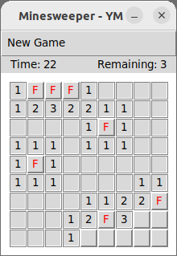

# Python-Mine: python based minesweeper

Learning project

## Implemented features
- Left click (reveal cells), right click (mark cell), left+right click (validate cell)
- Configurable difficulty
- Restart popup with button at win/lose
- Display timer and remaining mines

## Build and Run
Linux
- Run with Python environement: `python3 mine.py`

Windows
- Run with Python environement (powershell): `python.exe mine.py`
- Build standalone executable for Windows using [py2exe](https://github.com/py2exe/py2exe) (powershell): `python.exe freeze.py`
  - The result build is in `./dist`, double click `mine.exe` to run

## Development tools
- python3 on Linux / Windows
- gedit text editor
